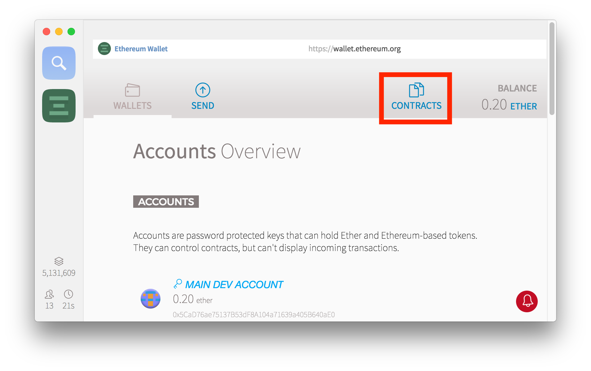
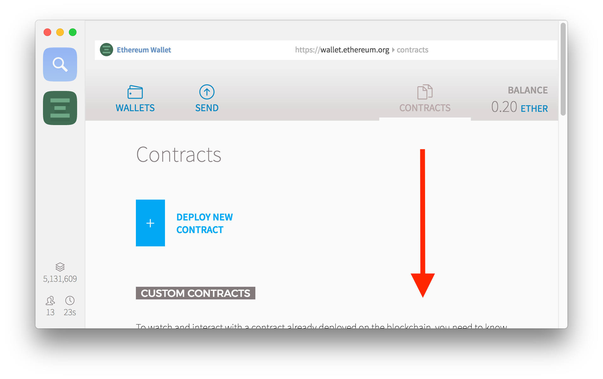
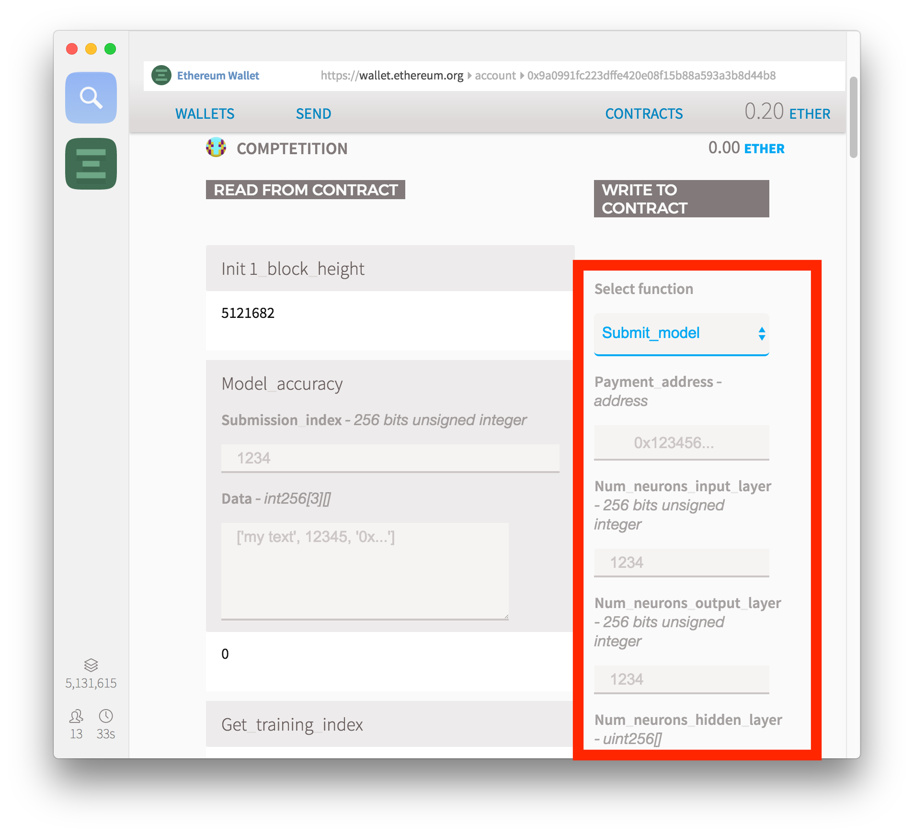
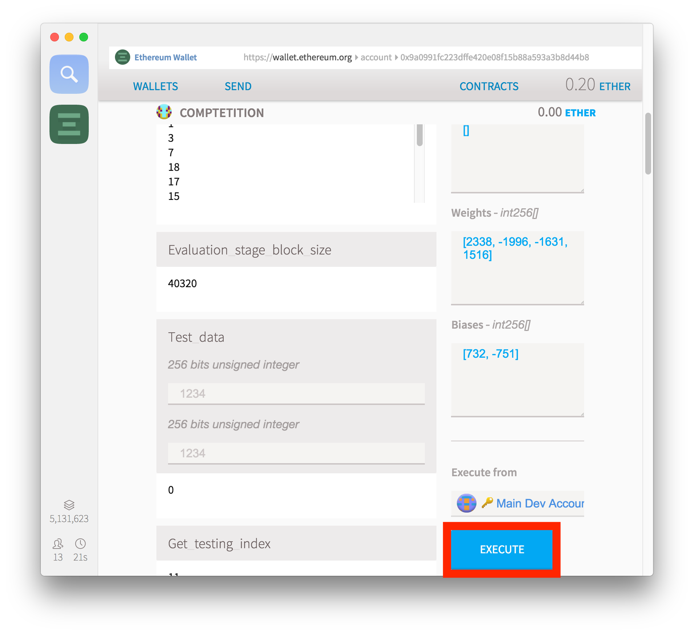
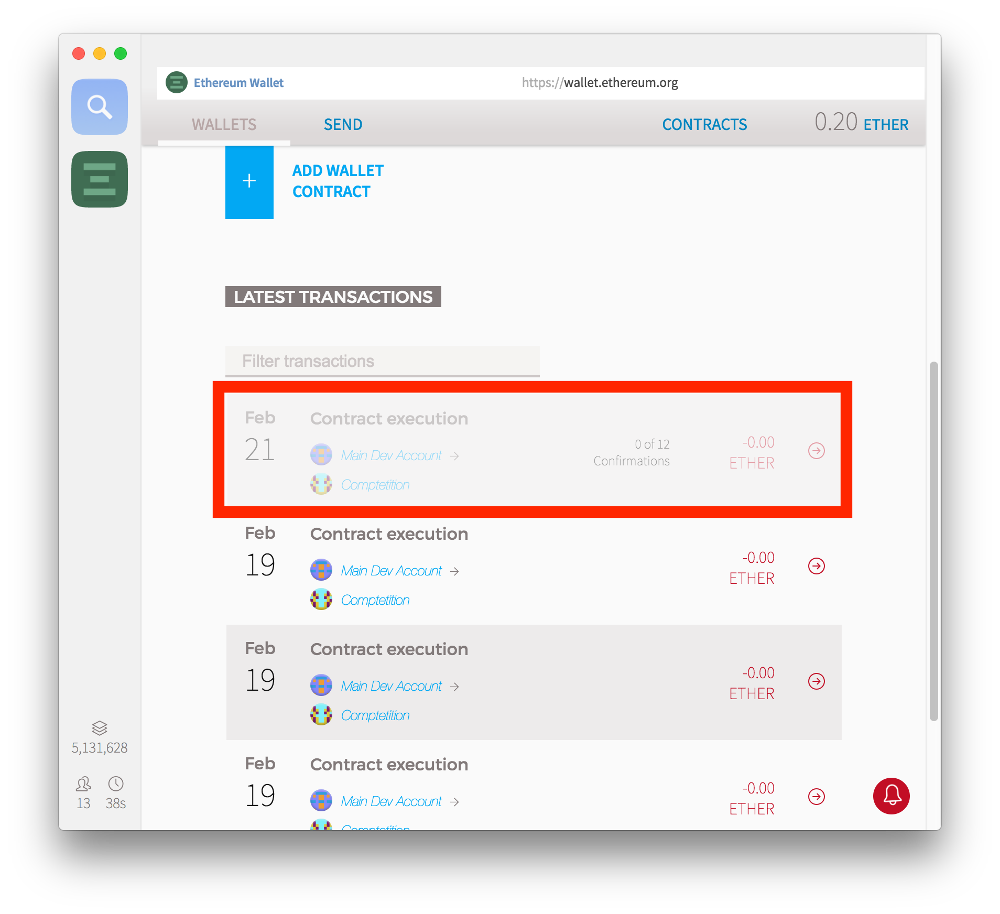

# First DanKu Competition

See [here](https://blog.algorithmia.com/trustless-machine-learning-contracts-danku/) for blog post describing the DanKu protocol and competition. See [whitepaper](https://algorithmia.com/research/ml-models-on-blockchain) for full details of the protocol.

Since we’ve just announced the protocol, we thought that it would be also fitting to create the first public DanKu contract.


For this competition, we’ve decided to use the 2016 U.S Presidential county election data as our dataset. Every county is represented with 3 data points: longitude, latitude and elected candidate.

For example, a data point can look something like this: `[047606200, 122332100, 0]`.
The first two values refers to the latitude and longitude of Seattle.
The third value, 0 refers to the Democratic candidate, whereas 1 refers to Republican candidate in this data format

500 random data points are selected as the dataset for this competition. 80% of this dataset will be used for training. The remaining 20% of the dataset will be used for evaluating the dataset. Since the training and testing datasets are randomly selected by the contract, the fairness of the competition is assured.

Participants of the contract are required to train a simple forward pass neural network where they can define the neural network structure in terms of layers, neurons and biases. After training, they are required to submit their network definition, weights and biases to the contract.

The reward for the winning submission is 5 ethereum.

## Some Info

This is the first ever publicly launched DanKu contract/competition.

The contract address is: [`0x9A0991fc223dFFE420e08f15b88a593a3b8D44B8`](https://etherscan.io/address/0x9A0991fc223dFFE420e08f15b88a593a3b8D44B8)

The contract was initialized on `block 5121944` (on Feb 19th, 2018), with 400 training data samples.

The contract has a submission period of `241920 blocks`, which corresponds to 6 weeks.

The contract has a test data reveal period of `17280 blocks`, which corresponds to 3 days.

The contract has a evaluation period of `40320 blocks`, which corresponds to 7 days.

The total size of the dataset is made up of 500 samples. For this contract, an 80% 20% split was made for training and testing data.

You can find the DanKu contract [here](#).

## How to participate

You first need a few things installed & running. Obviously you need some experience training ML models, but for the purpose of this competition, some sample code is provided for training a simple neural network. You can modify, or create your own model from scratch.

Since we're going to use the `populus` framework instead of `truffle`, this will make it easier to use most ML frameworks. `populus` and most ML libraries are Python based.

```
python -m venv venv;
source venv/bin/activate;
pip install -r requirements.txt
```

You also need `geth` up and running. This helps you interact with the contract, like downloading the test dataset and submitting your solution. Please refer to the official Ethereum guide for installing `geth` [here](https://github.com/ethereum/go-ethereum/wiki/Installing-Geth).

After you get `geth` running locally on the default port number `8545` you can connect to it and download the training dataset with the following script:

```python
python -W ignore competition/download_train_visualize.py
```

This script will download the training dataset, train a neural network and visualize the training data for you. The weights and biases will be automatically scaled for you. DanKu contracts expect the values to be scaled up by 10000 times, and rounded to integers.

We can now submit our model to the DanKu contract. Running the script should give you values something like:

```
Weights: [1, 2, 3, ...]

Biases: [1, 2, 3, ...]

Num_neurons_input_layer: 2

Num_neurons_output_layer: 2

Num_neurons_hidden_layer: [4]
```

These values are all part of your submission. Along with these values, you have additionally provide your payout address. To submit your solution, we first need to watch the contract in `mist`. First install the Mist browser by following the instructions [here](https://github.com/ethereum/mist).

After installing `mist`, and getting it to connect to `geth`, you need to create a wallet and fund it with some ethereum. Some funds are required to make a submission the the contract.

To watch the contract, first go to the `contracts` tab in `mist`.



After going to the `contracts` tab, scroll down until you see the `watch contracts` button.



Click on the `watch contract` button.


Enter the following information for the form that pops up.


Enter the following contract information:

Contract address: `0x9A0991fc223dFFE420e08f15b88a593a3b8D44B8`

Contract name: `Competition`

JSON interface:
```
[{"constant":true,"inputs":[],"name":"init1_block_height","outputs":[{"name":"","type":"uint256"}],"payable":false,"stateMutability":"view","type":"function"},{"constant":false,"inputs":[],"name":"init2","outputs":[],"payable":false,"stateMutability":"nonpayable","type":"function"},{"constant":false,"inputs":[{"name":"submission_index","type":"uint256"}],"name":"evaluate_model","outputs":[],"payable":false,"stateMutability":"nonpayable","type":"function"},{"constant":true,"inputs":[{"name":"submission_index","type":"uint256"},{"name":"data","type":"int256[3][]"}],"name":"model_accuracy","outputs":[{"name":"","type":"int256"}],"payable":false,"stateMutability":"view","type":"function"},{"constant":true,"inputs":[],"name":"get_training_index","outputs":[{"name":"","type":"uint256[16]"}],"payable":false,"stateMutability":"view","type":"function"},{"constant":true,"inputs":[],"name":"evaluation_stage_block_size","outputs":[{"name":"","type":"uint256"}],"payable":false,"stateMutability":"view","type":"function"},{"constant":true,"inputs":[{"name":"","type":"uint256"},{"name":"","type":"uint256"}],"name":"test_data","outputs":[{"name":"","type":"int256"}],"payable":false,"stateMutability":"view","type":"function"},{"constant":true,"inputs":[],"name":"get_testing_index","outputs":[{"name":"","type":"uint256[4]"}],"payable":false,"stateMutability":"view","type":"function"},{"constant":false,"inputs":[{"name":"_test_data_groups","type":"int256[]"},{"name":"_test_data_group_nonces","type":"int256"}],"name":"reveal_test_data","outputs":[],"payable":false,"stateMutability":"nonpayable","type":"function"},{"constant":true,"inputs":[{"name":"paymentAddress","type":"address"},{"name":"num_neurons_input_layer","type":"uint256"},{"name":"num_neurons_output_layer","type":"uint256"},{"name":"num_neurons_hidden_layer","type":"uint256[]"},{"name":"weights","type":"int256[]"},{"name":"biases","type":"int256[]"}],"name":"get_submission_id","outputs":[{"name":"","type":"uint256"}],"payable":false,"stateMutability":"view","type":"function"},{"constant":true,"inputs":[],"name":"best_submission_index","outputs":[{"name":"","type":"uint256"}],"payable":false,"stateMutability":"view","type":"function"},{"constant":true,"inputs":[],"name":"use_test_data","outputs":[{"name":"","type":"bool"}],"payable":false,"stateMutability":"view","type":"function"},{"constant":false,"inputs":[{"name":"_train_data_groups","type":"int256[]"},{"name":"_train_data_group_nonces","type":"int256"}],"name":"init3","outputs":[],"payable":false,"stateMutability":"nonpayable","type":"function"},{"constant":true,"inputs":[{"name":"l_nn","type":"uint256[]"},{"name":"input_layer","type":"int256[]"},{"name":"hidden_layers","type":"int256[]"},{"name":"output_layer","type":"int256[]"},{"name":"weights","type":"int256[]"},{"name":"biases","type":"int256[]"}],"name":"forward_pass2","outputs":[{"name":"","type":"int256[]"}],"payable":false,"stateMutability":"pure","type":"function"},{"constant":false,"inputs":[{"name":"_hashed_data_groups","type":"bytes32[20]"},{"name":"accuracy_criteria","type":"int256"},{"name":"organizer_refund_address","type":"address"}],"name":"init1","outputs":[],"payable":false,"stateMutability":"nonpayable","type":"function"},{"constant":true,"inputs":[],"name":"organizer","outputs":[{"name":"","type":"address"}],"payable":false,"stateMutability":"view","type":"function"},{"constant":true,"inputs":[],"name":"init_level","outputs":[{"name":"","type":"uint256"}],"payable":false,"stateMutability":"view","type":"function"},{"constant":true,"inputs":[{"name":"","type":"uint256"}],"name":"testing_partition","outputs":[{"name":"","type":"uint256"}],"payable":false,"stateMutability":"view","type":"function"},{"constant":true,"inputs":[],"name":"get_train_data_length","outputs":[{"name":"","type":"uint256"}],"payable":false,"stateMutability":"view","type":"function"},{"constant":true,"inputs":[],"name":"best_submission_accuracy","outputs":[{"name":"","type":"int256"}],"payable":false,"stateMutability":"view","type":"function"},{"constant":false,"inputs":[],"name":"finalize_contract","outputs":[],"payable":false,"stateMutability":"nonpayable","type":"function"},{"constant":true,"inputs":[],"name":"contract_terminated","outputs":[{"name":"","type":"bool"}],"payable":false,"stateMutability":"view","type":"function"},{"constant":true,"inputs":[],"name":"init3_block_height","outputs":[{"name":"","type":"uint256"}],"payable":false,"stateMutability":"view","type":"function"},{"constant":true,"inputs":[],"name":"get_submission_queue_length","outputs":[{"name":"","type":"uint256"}],"payable":false,"stateMutability":"view","type":"function"},{"constant":false,"inputs":[{"name":"payment_address","type":"address"},{"name":"num_neurons_input_layer","type":"uint256"},{"name":"num_neurons_output_layer","type":"uint256"},{"name":"num_neurons_hidden_layer","type":"uint256[]"},{"name":"weights","type":"int256[]"},{"name":"biases","type":"int256[]"}],"name":"submit_model","outputs":[],"payable":false,"stateMutability":"nonpayable","type":"function"},{"constant":true,"inputs":[{"name":"","type":"uint256"}],"name":"training_partition","outputs":[{"name":"","type":"uint256"}],"payable":false,"stateMutability":"view","type":"function"},{"constant":true,"inputs":[],"name":"reveal_test_data_groups_block_size","outputs":[{"name":"","type":"uint256"}],"payable":false,"stateMutability":"view","type":"function"},{"constant":false,"inputs":[],"name":"cancel_contract","outputs":[],"payable":false,"stateMutability":"nonpayable","type":"function"},{"constant":true,"inputs":[],"name":"model_accuracy_criteria","outputs":[{"name":"","type":"int256"}],"payable":false,"stateMutability":"view","type":"function"},{"constant":true,"inputs":[{"name":"","type":"uint256"},{"name":"","type":"uint256"}],"name":"train_data","outputs":[{"name":"","type":"int256"}],"payable":false,"stateMutability":"view","type":"function"},{"constant":true,"inputs":[],"name":"get_test_data_length","outputs":[{"name":"","type":"uint256"}],"payable":false,"stateMutability":"view","type":"function"},{"constant":true,"inputs":[],"name":"submission_stage_block_size","outputs":[{"name":"","type":"uint256"}],"payable":false,"stateMutability":"view","type":"function"},{"inputs":[],"payable":false,"stateMutability":"nonpayable","type":"constructor"},{"payable":true,"stateMutability":"payable","type":"fallback"}]
```


After filling out the form and watching the contract, go to the contract page and find the function dropdown list.


Selecting `submit_model` in the dropdown list should list all of the fields that are needed for a submission.



Fill out the fields with the weights, biases, and network description that you've trained on, including your payout address.



Enter your wallet password, and submit your solution to the DanKu contract.


You should see your transaction pending in the wallets tab in `mist`. Wait until your submission gets confirmed.



And voila! You've just submitted your first solution to the World's first DanKu contract!

## End to end example

If you want to see how a DanKu contract functions end to end, you can checkout [one of the tests](../tests/test_danku.py) in debug mode. This will spit out all of the important info in the console to help better understand how DanKu contracts work.

Make sure in `config.py` you change `DEBUG = False` to `DEBUG = True`.

And run:

```python
python -m pytest -q tests/test_danku.py
```

## Questions and more

If you have questions, or find a bugs anywhere, please create an issue [here](https://github.com/algorithmiaio/danku/issues).
